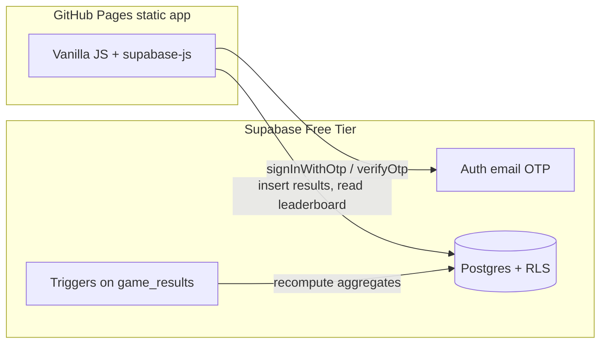

# Supabase Leaderboard Backend Plan

## Current state

- **App:** Static vanilla JS monorepo on GitHub Pages ([index.html](index.html), [hated-game/game.js](hated-game/game.js)). No build step, no auth, no persistent stats. Score = cards in foundations (0–52); outcomes are `win` / `loss`; **forfeit is not implemented yet** (backend will still support the outcome).
- **Supabase project:** `https://oxcrkikwjushtszpdigq.supabase.co` — **empty schema** (0 tables, 0 migrations, 0 edge functions). **Custom SMTP via Resend is already enabled** in the Dashboard.
- **Constraint:** Static hosting → browser talks to Supabase directly with the **publishable/anon key**. Never ship the service role key. Security = RLS + carefully chosen write paths.

## Architecture




No Edge Functions required for v1. Auth sessions live in the browser (`localStorage` via supabase-js). Cross-device login = same email + new OTP on the other device.

## Supabase MCP (implementation)

When this plan is executed, the agent **should change the linked Supabase project via MCP**, including:

- `apply_migration` / `execute_sql` for schema, RLS, triggers, seed data
- `list_tables` / `list_migrations` / `get_advisors` to verify
- Any other MCP-supported project mutations needed for this backend

Keep migration SQL in-repo under `supabase/migrations/` as well, so the remote state and git stay aligned. Auth items MCP cannot set (e.g. Site URL, email templates) remain short Dashboard follow-ups. **Custom SMTP (Resend) is already done — do not reconfigure.**

---

## Auth

**v1 method:** Email OTP only (no passwords).

Client flow:

1. `supabase.auth.signInWithOtp({ email })` — creates user on first use
2. User enters 6-digit code
3. `supabase.auth.verifyOtp({ email, token, type: 'email' })` → session JWT
4. Subsequent API calls use that session automatically

**Done already**

- Custom SMTP enabled with Resend (`smtp.resend.com`; username `resend`; API key as password). Auth emails go through Resend; rate limit is the custom-SMTP tier (~30/hour, adjustable).

**Still required** (agent via MCP if possible; otherwise Dashboard):


| Setting                                                                           | Why                                          |
| --------------------------------------------------------------------------------- | -------------------------------------------- |
| **Site URL** = your GitHub Pages origin                                           | Auth redirect / origin validation            |
| **Redirect URLs** include Pages URL (+ `http://localhost:`* for local `serve.py`) | Required even for OTP-heavy flows            |
| **Magic Link email template** includes `{{ .Token }}`                             | Turns magic-link mail into a 6-digit OTP     |
| Prefer OTP-focused template text                                                  | UX: “enter this code”, not “click this link” |


With custom SMTP in place, template customization should work on free tier. No password auth in the app — leave email provider on; never call password APIs. Email stays in `auth.users`, not in `profiles`.

**Later (design now, enable later):**

- **Anonymous users:** `signInAnonymously()` → same `auth.users` / same `profiles` + `game_results` rows; JWT has `is_anonymous`. Upgrade by linking email (`updateUser({ email })` + OTP). Schema already keys everything on `auth.users.id`, so no schema rewrite.
- **Passkeys:** Supabase supports experimental WebAuthn (`registerPasskey` / `signInWithPasskey`). Requires Dashboard Passkeys + RP ID = your Pages domain. No extra app tables; credentials live in Auth.

---

## Schema design (chosen approach)

**One shared results table + one shared stats table, keyed by `game_slug` text — not a table per game, and no separate `games` catalog.**

Why:

- Leaderboard fields you listed are shared across games
- Adding a game = start writing a new slug from the client (display names live in the frontend)
- Game-specific extras go in `jsonb`
- Aggregates stay fast via a maintained stats table
- A `games` UUID catalog is unnecessary overhead for a small, app-owned set of slugs

### Tables

#### 1. `profiles` — user-facing identity

Keeps app display data separate from Auth’s `auth.users` (identity/email).


| Column                      | Type          | Notes |
| --------------------------- | ------------- | ----- |
| `id`                        | `uuid` PK     | `references auth.users(id) on delete cascade` |
| `screen_name`               | `text` nullable | Stored **exactly as the user typed it** (case preserved for display, e.g. `Lydia`). No plain unique on this column. |
| `created_at` / `updated_at` | `timestamptz` | |

**Screen name uniqueness:** case-insensitive via a partial unique index `CREATE UNIQUE INDEX ... ON profiles (lower(screen_name)) WHERE screen_name IS NOT NULL`, while the stored value keeps original casing (`Lydia`) for display. Build notes: enforce `CHECK (char_length(screen_name) BETWEEN 3 AND 24)` (pick final bounds at build time), normalize with a `BEFORE INSERT OR UPDATE` trigger (`NULLIF(trim(...), '')`), and handle `23505` on rename as "name taken" in the future UI.

Created by a trigger on `auth.users` insert (`handle_new_user`, `SECURITY DEFINER ... SET search_path = public`, `INSERT ... ON CONFLICT DO NOTHING`). Anonymous-ready: row exists even when `screen_name` is null; exclude null names from public leaderboard. Client has **no INSERT** on `profiles` (trigger owns creation) — UPDATE own row only.

#### 2. `game_results` — append-only event log (source of truth)


| Column             | Type                          | Notes |
| ------------------ | ----------------------------- | ----- |
| `id`               | `uuid` PK                     | |
| `user_id`          | `uuid`                        | `references auth.users` |
| `game_slug`        | `text` not null               | Stable app key, e.g. `hated-game`. Not a FK. `CHECK (game_slug ~ '^[a-z0-9-]+$')` catches case/typo splits (`Hated-Game` vs `hated-game`) without enumerating games. |
| `outcome`          | `text` check                  | `'win' \| 'loss' \| 'forfeit'` via `CHECK (outcome in (...))` |
| `score`            | `integer` not null            | `CHECK (score >= 0)`. Hated Game: 0–52, and **early wins are submitted as `outcome='win', score=52`** (see wiring map below); other games define their own scale |
| `extra`            | `jsonb` not null default `{}` | Per-game fields. Hated Game sends `{}` (no game-specific fields needed); future games may use it (e.g. `{ "early_win": true }`-style flags) |
| `client_result_id` | `uuid` `not null default gen_random_uuid()` | Client-generated; **unique (user_id, game_slug, client_result_id)** for idempotent retries. `NOT NULL` is load-bearing: Postgres unique constraints ignore `NULL`s, so a nullable column would let retries double-insert. Client contract: new UUID per game, reuse the same UUID on retry, treat `23505` as "already submitted". |
| `played_at`        | `timestamptz` default `now()` | Server default; client may omit. |

Do **not** let clients UPDATE/DELETE results in v1. `game_slug` stays opaque text owned by the client (no `games` catalog); the format `CHECK` above is the only guard.

#### 3. `player_stats` — per-user, per-game aggregates (leaderboard read model)


| Column         | Type                       | Notes |
| -------------- | -------------------------- | ----- |
| `user_id`      | `uuid`                     | PK part |
| `game_slug`    | `text`                     | PK part (same slug strings as `game_results`) |
| `wins`         | `int` default 0            | |
| `losses`       | `int` default 0            | |
| `forfeits`     | `int` default 0            | |
| `games_played` | `int` default 0            | `wins + losses + forfeits` |
| `score_total`  | `bigint` default 0         | Lifetime sum of `score` |
| `win_rate`     | `numeric` generated stored | `wins::numeric / nullif(games_played, 0)` — always in sync; sortable/indexable |
| `updated_at`   | `timestamptz`              | |

**Why store `win_rate`:** Sorting via supabase-js needs a real column name (`.order('win_rate')`). A Postgres `GENERATED ... STORED` column gives that without trigger logic — it updates automatically whenever `wins` / `games_played` change. It can also be indexed for efficient leaderboard sorts as the table grows.

Formula: `win_rate = wins / games_played` (forfeits count in the denominator). Null when `games_played = 0`.

Maintained counters (`wins`, etc.) come from an `AFTER INSERT` trigger on `game_results` (`SECURITY DEFINER ... SET search_path = public`) that upserts the matching `player_stats` row (`INSERT ... ON CONFLICT (user_id, game_slug) DO UPDATE`). Clients never write `player_stats` directly; they never write `win_rate` either (generated). `updated_at` on `profiles` / `player_stats` is maintained by a `BEFORE UPDATE` `set_updated_at` trigger — don't rely on the client to set it.

### Public `leaderboard` view

`leaderboard` view joining `player_stats` + `profiles`, filtering `screen_name is not null` and `games_played > 0`, selecting:

- `user_id`, `screen_name`, `game_slug`
- `wins`, `losses`, `forfeits`, `games_played`, `score_total`, `win_rate`

**Security model (decision): SECURITY DEFINER view (option A).** The view is owned by `postgres` with `security_invoker = false`, so it bypasses RLS on the base tables and exposes *only* these public columns. `anon` and `authenticated` both get `SELECT` on the view; neither gets direct `SELECT` on `player_stats` (except own-row reads, see RLS). This avoids the `security_invoker` trap where an `anon` read through the view would be blocked by base-table RLS and return zero rows. `user_id` is included so "my stats" can be read as `from('leaderboard').select(...).eq('user_id', <own id>)` without a second code path — UUIDs are unguessable and already linkable via `screen_name`, so exposure is minimal and intentional.

Client sort examples (every column is sortable; always add a stable tiebreaker for pagination):

```js
// Win rate (default leaderboard sort). Secondary sorts keep pagination stable.
// Note: raw win_rate favors 1–0 over 100–1; games_played second mitigates it.
// UI exposes a sort picker over all columns; this is the default.
.from('leaderboard').select(...).eq('game_slug', 'hated-game').order('win_rate', { ascending: false, nullsFirst: false }).order('games_played', { ascending: false }).order('screen_name', { ascending: true }).limit(n)
// Most total scoring (grinder board)
.from('leaderboard').select(...).eq('game_slug', 'hated-game').order('score_total', { ascending: false }).order('screen_name', { ascending: true }).limit(n)
// Most wins / most games — same pattern over wins / games_played
```

### What we are **not** doing

- A `games` catalog table (slug text is enough)
- Separate `hated_game_results` / `hated_game_stats` tables
- Storing passwords or email in `profiles` (email stays in `auth.users`)
- Edge Functions for submit/leaderboard in v1
- Server-side score verification (trust client for casual v1; document as known limitation)

---

## RLS policies (critical for static client)

Enable RLS on all public tables.


| Table              | anon                                   | authenticated                                                                              |
| ------------------ | -------------------------------------- | ------------------------------------------------------------------------------------------ |
| `profiles`         | SELECT where `screen_name is not null` | SELECT public rows; UPDATE **own** row only (`USING (id = auth.uid()) WITH CHECK (id = auth.uid())` — `id` immutable, no INSERT; trigger owns creation) |
| `game_results`     | no access                              | INSERT with `WITH CHECK (user_id = auth.uid())`; SELECT own rows only (history). No update/delete |
| `player_stats`     | no direct access (read via view)       | no direct writes; SELECT own row (`user_id = auth.uid()`) if needed, else read via view   |
| `leaderboard` view | SELECT (SECURITY DEFINER, public cols only) | SELECT                                                                  |


When anonymous auth is enabled later: same policies work; optionally hide anonymous users from the public leaderboard until `screen_name` is set / `is_anonymous` is false (`(auth.jwt()->>'is_anonymous')::boolean`).

---

## How the static app talks to Supabase

1. Add `@supabase/supabase-js` via CDN ESM import (no bundler required), or a vendored copy in-repo. **Pin an exact version** (e.g. `supabase-js@2.x.y`), not `latest`.
2. Create a small shared module e.g. `lib/supabase.js` with:

```js
createClient(SUPABASE_URL, SUPABASE_ANON_KEY)
```

URL + anon/publishable key are public by design (safe in static Pages). Keep them in a tiny config file or build-time inject; **never** commit the service role key (`.env` already gitignored).

3. Backend API surface the app will eventually call (no UI this phase — document/contract only):


| Concern         | Client calls                                                                               |
| --------------- | ------------------------------------------------------------------------------------------ |
| Login           | `signInWithOtp` → `verifyOtp`                                                              |
| Logout          | `auth.signOut()`                                                                           |
| Session restore | `auth.getSession()` / `onAuthStateChange`                                                  |
| Screen name     | `from('profiles').update({ screen_name })`                                                 |
| Submit result   | `from('game_results').insert({ game_slug, outcome, score, extra, client_result_id })`      |
| Leaderboard     | `from('leaderboard').select(...).eq('game_slug', ...).order(...).limit(n)`                 |
| My stats        | `from('leaderboard').select(...).eq('user_id', <own id>)` (view includes `user_id`), or `player_stats` own-row read |


4. Map Hated Game end states when wiring later: `winDeclared === true` (covers both full clear `score() === 52` and the early-win path in `evaluateGame()`) → `outcome: 'win', score: 52, extra: {}`; `gameOver === 'loss'` → `outcome: 'loss', score: score()`; new forfeit path → `outcome: 'forfeit', score: score()`; always `game_slug: 'hated-game'`. Early wins are recorded as full 52s by design — no `early_win` flag needed for Hated Game; `extra` stays reserved for future games.

Build / integration notes (keep in mind, not separate phases):
- New local `lib/supabase.js` must be added to `sw.js` `ASSETS` with a `CACHE_NAME` bump, or Pages will serve stale shell code (CDN ESM responses pass through the SW uncached — fine as-is).
- Redirect URLs need both `http://localhost:8080` and `http://127.0.0.1:8080` (`serve.py` binds `0.0.0.0`); Site URL must be the exact Pages origin including subpath.
- Smoke test without polluting the real leaderboard: use a throwaway OTP user or a `test-*` slug — there is no DELETE path in v1, so fake `hated-game` rows as your real user are permanent.
- OTP resends during testing count against the ~30/hr custom-SMTP tier; plan one OTP per device.
- Future UI: leaderboard gets a sort picker over all columns (default `win_rate desc, games_played desc, screen_name asc`); rename collisions surface as `23505` → "name taken".

---

## Repo / migration workflow (when implementing)

- Add `supabase/migrations/*.sql` in the repo (source of truth) describing tables, indexes, triggers, RLS.
- **Apply the same SQL to the remote project via Supabase MCP** (`apply_migration` / `execute_sql` as appropriate). The agent is expected to mutate the linked Supabase project this way during implementation.
- Verify with MCP (`list_tables`, `list_migrations`, advisors) after apply.
- Generate or hand-maintain TypeScript types is optional; this repo is plain JS — skip types unless you want them for docs.

Suggested indexes on `player_stats`: `(game_slug, score_total desc)`, `(game_slug, win_rate desc nulls last)`, plus `(user_id, game_slug, played_at desc)` on `game_results` and unique `(user_id, game_slug, client_result_id)`.

---

## Implementation phases (backend-first)

1. **SQL schema** — write migrations in-repo, then apply via Supabase MCP (`apply_migration`): `profiles`, `game_results`, `player_stats`, indexes, `handle_new_user`, stats trigger, RLS, `leaderboard` view
2. **Auth setup** — Site URL, redirect URLs, OTP email template (`{{ .Token }}`). SMTP/Resend already done.
3. **Thin JS client module** — createClient + auth/result/leaderboard helpers (no UI)
4. **Smoke test** — MCP SQL checks + thin client: OTP login, set screen name, insert fake results, confirm stats + leaderboard
5. **Later revisions** — enable anonymous sign-in + link email; enable passkeys; optional anti-cheat / Edge Function verification; forfeit UX in the game

---

## Decisions locked in this plan

- Shared `game_results` + `player_stats` keyed by `game_slug` text — **no `games` table**
- `profiles.screen_name` stored with original casing for display; uniqueness via partial unique index on `lower(screen_name)` where not null; no client INSERT (trigger owns creation)
- `win_rate` stored as a generated column on `player_stats` so leaderboards can `.order('win_rate')` (and index it); all leaderboard columns sortable with stable tiebreakers (`games_played desc, screen_name asc`)
- Public `leaderboard` is a SECURITY DEFINER view (public columns only, incl. `user_id` for my-stats filtering); no direct anon access to base tables
- `client_result_id` is `NOT NULL DEFAULT gen_random_uuid()` so the idempotency unique actually dedupes retries
- Hated Game: `winDeclared` (full clear or early win) submits `outcome='win', score=52, extra={}`; `extra` reserved for future games
- Clients insert results only; triggers own aggregates; `win_rate` auto-derived
- Email OTP for v1; schema already compatible with anonymous + passkeys
- **Custom SMTP via Resend is configured** (prerequisite complete); remaining Auth work is Site URL / redirects / OTP template
- Trust client-reported scores for v1
- On implementation, the agent **may and should** change the Supabase project through the Supabase MCP (migrations, SQL, verification); only MCP-unreachable Auth settings stay as user Dashboard steps

